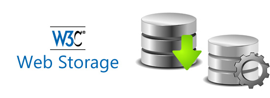
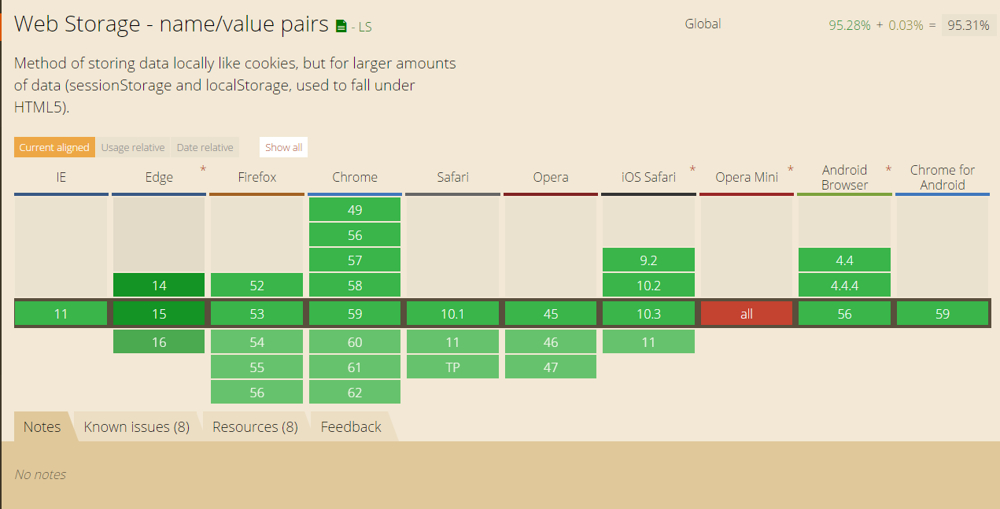
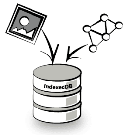

# Modern Web Storage

<br>
<small>by Kristof Degrave</small>

Note:

### About

T.B.D

---

# mjr

https://github.com/mjrio/mjr-frontend-webstorage


---

# Webstorage
<br>

----

## Strucutre

- localstorage
- sessionstorage

- Key/value pairs
    + **Key**: string
    + **Value**: string

Note:
 Data stored in sessionStorage gets cleared when the page session ends. A page session lasts for as long as the browser is open and survives over page reloads and restores. Opening a page in a new tab or window will cause a new session to be initiated.
 SessionStorage is limited to a single tab or page. Localstorage shares data over multiple. (respecting the origin)
 https://www.w3.org/TR/webstorage/
 
 sessionStorage maintains a separate storage area for each given origin that's available for the duration of the page session (as long as the browser is open, including page reloads and restores).
 localStorage does the same thing, but persists even when the browser is closed and reopened.

- Durable data
    + data still exists after page refresh
    + stays on the client (not transmitted to server like cookies)

Key: string
Value: string

----

## Store Data

```javascript
window.localStorage.setItem("key", "value");
```

----

## Retrieve/Query Data

Get one
```javascript
var value = window.localStorage.getItem("key");
```

Get all
```javascript
for(let i = 0; i < window.localStorage.lenght; i++){
    var key = window.localStorage.key(i);
    var value = window.localStorage.getItem(key);
}
```

----

## Remove Data

Remove one
```javascript
window.localStorage.removeItem("key");
```

Remove all
```javascript
window.localStorage.clear();
```

----
## API

```javascript
interface Storage {
  readonly long length;
  DOMString? key(unsigned long index);
  DOMString? getItem(DOMString key);
  void setItem(DOMString key, DOMString value);
  void removeItem(DOMString key);
  void clear();
};
```
Note:
- length: returns the number of pairs present in the storage object.
- key: returns the key present at the provided index.
- getItem: retrieves an item with a given key, returns null if not found.
- setItem: sets the value for a given key, if the key exists, the value is overwritten, otherwise it's added.
- removeItem: removes an item for a given key.
- clear: removes all pairs present in the storage object.

----

## Quota

- 5mb limit
- optionaly increase possible (browser dependend)

Note:
- 5mb is recommended by the specs 
    + this is per origin
- Most browsers don't allow an increase

----

## Browser support

  
[http://caniuse.com/#feat=namevalue-storage](http://caniuse.com/#feat=namevalue-storage)

----

## Resources

[http://caniuse.com/#feat=namevalue-storage](http://caniuse.com/#feat=namevalue-storage)
[https://www.w3.org/TR/webstorage/](https://www.w3.org/TR/webstorage/)

---

# indexedDB

<br>

----

## Structure

- Databases
- Object stores
- Indexes
- Key/value pairs
    + **Key**: number|date|string|binary|array
    + **Value**: Primitive values|objects|array|file|blob 

Note:
You can have 
- multiple databases on a single origin
- multiple objectstores on a database
- multiple indexes on an object store
Key: A key has an associated type which is one of: (http://w3c.github.io/IndexedDB/#key-construct)
- number
- date
- string
- binary (new in v2)
- array
Value: any (JSON) serializable object (Stored and retrived by value, in favour of by reference - http://w3c.github.io/IndexedDB/#value-construct)
- Primitive values like string, number, Date
- Objects
- Arrays
- File, Blob, Image data
----

## Good to Know

- Asynchronous
- Transactional
    + readonly
    + readwrite
    + versionchange

Note:
- Async by callbacks, not with promises

- When creating a transaction a scope must be defined (object store names)
- Transactions committed by default, rollback (abort) must be called explicit

----

## Managing databases

```javascript
interface IDBFactory {
    IDBOpenDBRequest open (DOMString name, optional long version);
    IDBOpenDBRequest deleteDatabase (DOMString name);
    short            cmp (any first, any second);
};
```

<a href="http://localhost:9000/createDb/index.html" target="_blank">demo<a/>

Note:

cmp: array > binary > string > date > number
array, binary, string -> first by (total) length, next value compare

----

## Store Data

```javascript
interface IDBObjectStore {
    ...
    IDBRequest put (any value, optional any key);
    IDBRequest add (any value, optional any key);
    ...
};
```

<a href="http://localhost:9000/storeData/index.html" target="_blank">demo<a/>


Note:
- add will add a new record and if the key of the record exists, it will throw an error.
- put will update a record if the key exists and add it if the key doesn't exist.

----

## Retrieve/Query Data

```javascript
interface IDBObjectStore {
    ...
    IDBRequest get(any query);
    IDBRequest getKey(any query);
    IDBRequest getAll(optional any query, optional long count);
    IDBRequest getAllKeys(optional any query, optional long count);
    IDBRequest count(optional any query);

    IDBRequest openCursor(optional any query, optional IDBCursorDirection direction = "next");
    IDBRequest openKeyCursor(optional any query, optional IDBCursorDirection direction = "next");
    ...
```

Note:
get & getKey get the first result that matches the query
getAll & getAllKeys return all the values that match in the result.
getKey, getAllKeys, openKeyCursor, getAll are new since v2

----

## Retrieve/Query Data

```javascript
interface IDBIndex {
    ...
    IDBRequest get(any query);
    IDBRequest getKey(any query);
    IDBRequest getAll(optional any query, optional long count);
    IDBRequest getAllKeys(optional any query, optional long count);
    IDBRequest count(optional any query);
    IDBRequest openCursor(optional any query, optional IDBCursorDirection direction = "next");
    IDBRequest openKeyCursor(optional any query, optional IDBCursorDirection direction = "next");
    ...
```

Note:
get & getKey get the first result that matches the query
getAll & getAllKeys return all the values that match in the result.
getAllKeys, getAll are new since v2

----

## Retrieve/Query Data

```javascript
interface IDBKeyRange {
  readonly attribute any lower;
  readonly attribute any upper;
  readonly attribute boolean lowerOpen;
  readonly attribute boolean upperOpen;

  // Static construction methods:
  static IDBKeyRange only(any value);
  static IDBKeyRange lowerBound(any lower, optional boolean open = false);
  static IDBKeyRange upperBound(any upper, optional boolean open = false);
  static IDBKeyRange bound(any lower,
                           any upper,
                           optional boolean lowerOpen = false,
                           optional boolean upperOpen = false);

  boolean includes(any key);
};
```

<a href="http://localhost:9000/retrieveData/index.html" target="_blank">demo<a/>

Note:
includes is new since v2

----

## Remove Data

```javascript
interface IDBObjectStore {
    ...  
    IDBRequest delete(any query);
    IDBRequest clear();
    ...
};
```

----

## Database

```javascript
interface IDBFactory {
    IDBOpenDBRequest open (DOMString name, [EnforceRange] optional unsigned long long version);
    IDBOpenDBRequest deleteDatabase (DOMString name);
    short            cmp (any first, any second);
};
```

```javascript
interface IDBDatabase : EventTarget {
    readonly    attribute DOMString          name;
    readonly    attribute unsigned long long version;
    readonly    attribute DOMStringList      objectStoreNames;
    IDBObjectStore createObjectStore (DOMString name, optional IDBObjectStoreParameters optionalParameters);
    void           deleteObjectStore (DOMString name);
    IDBTransaction transaction ((DOMString or sequence<DOMString>) storeNames, optional IDBTransactionMode mode = "readonly");
    void           close ();
                attribute EventHandler       onabort;
                attribute EventHandler       onerror;
                attribute EventHandler       onversionchange;
};
```

----


## Object store

```javascript
interface IDBObjectStore {
    readonly    attribute DOMString      name;
    readonly    attribute any            keyPath;
    readonly    attribute DOMStringList  indexNames;
    readonly    attribute IDBTransaction transaction;
    readonly    attribute boolean        autoIncrement;
    IDBRequest put (any value, optional any key);
    IDBRequest add (any value, optional any key);
    IDBRequest delete (any key);
    IDBRequest get (any key);
    IDBRequest clear ();
    IDBRequest openCursor (optional any range, optional IDBCursorDirection direction = "next");
    IDBIndex   createIndex (DOMString name, (DOMString or sequence<DOMString>) keyPath, optional IDBIndexParameters optionalParameters);
    IDBIndex   index (DOMString name);
    void       deleteIndex (DOMString indexName);
    IDBRequest count (optional any key);
};
```

----

## Index 

```javascript
interface IDBIndex {
    readonly    attribute DOMString      name;
    readonly    attribute IDBObjectStore objectStore;
    readonly    attribute any            keyPath;
    readonly    attribute boolean        multiEntry;
    readonly    attribute boolean        unique;
    IDBRequest openCursor (optional any range, optional IDBCursorDirection direction = "next");
    IDBRequest openKeyCursor (optional any range, optional IDBCursorDirection direction = "next");
    IDBRequest get (any key);
    IDBRequest getKey (any key);
    IDBRequest count (optional any key);
};
```

----

## Cursor

```javascript
interface IDBCursor {
    readonly    attribute (IDBObjectStore or IDBIndex) source;
    readonly    attribute IDBCursorDirection           direction;
    readonly    attribute any                          key;
    readonly    attribute any                          primaryKey;
    IDBRequest update (any value);
    void       advance ([EnforceRange] unsigned long count);
    void       continue (optional any key);
    IDBRequest delete ();
};
```

----


Objectstore - Single result
```javascript
var objectstore = getObjectStore();
var getRequest = objectstore.get(1);
getRequest.onsucces = function(e) {
    var value = getRequest.value;
}
```

Objectstore - multiple
```javascript
var objectstore = getObjectStore();
var cursorRequest = objectstore.openCursor(IDBKeyRange.bound(1,2));
var values = [];
cursorRequest.onsucces = function(e) {
    values.push(cursorRequest.value);
    cursorRequest.source.continue();
}
```

By index
```javascript
for(let i = 0; i < window.localStorage.lenght; i++){
    var key = window.localStorage.key(i);
    var value = window.localStorage.getItem(key);
}
```
----